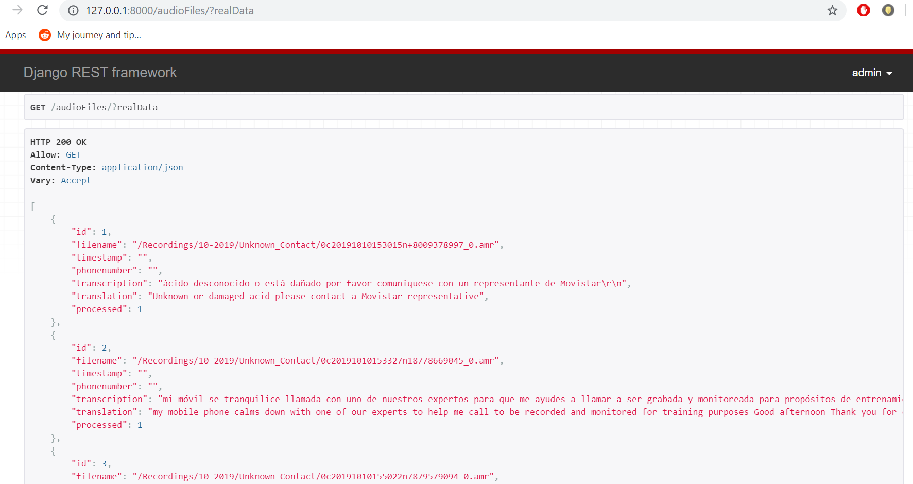

 # NetHope technical support SOW
Goal: Create script to do partial transcriptions of audio based on timestamps created by KoBoToolbox

## Requirements
- Python 3.6
- pip
- virtualenv

## Setup
````
pip install virtualenv
````
- Create a virtual environment
The following assumes that the global python is 3.6
````
virtualenv env
````
- Activate the virtual environment
    - In windows
        ````
        ./env/Scripts/activate
        ````
    - In linux/MAC OS
        ````
        source /env/bin/activate
        ````
- Download dependencies
  ````
  pip install -r requirements.txt
  ````
- Add the Following to the enviroment variable 
    - GOOGLE_APPLICATION_CREDENTIALS: This variable links links to the json file
 containing the private key for google cloud
        * Name the file containing google's service private key google_pk.json and store it in root directory of this project
    - DropBox_API_KEY: the API KEY for dropbox
    - username: the user name to access the data in the audio files table
    - password: username's password
    
- Start the proxy server which would link the running django server to the google cloud's MySQL's server
    - Store google applications's credential in the root directory of this project
    - Install the proxy server and store it in the root directory of this project
        - Refer to Installing the Cloud SQL Proxy in the following documentation https://cloud.google.com/sql/docs/mysql/sql-proxy
    - Run the following
    ```
       ./cloud_sql_proxy -instances="nethope-pr-assessment:us-central1:nethopemysql"=tcp:5505 -credential_file="./google_pk.json"
    ```
- Start the django server
    ```
     python ./src/djangoScr/manage.py runserver
    ```
    
## Current API Features
###  Starting transcription
To start the process, simply send a put request (http://127.0.0.1:8000/dropboxListener/1/) with attribute listen set to 1 

This will start the following in the backend
 - Check if a thread to do the following was already created before. If it was created before, then ignore the request
 - If it was not created before, create a separate thread and start the following process in it
    - get all supported audio files (wav, mp3, ) from all the folders of the linked Dropbox account
    - Check if any of those audio files are already processed before
    - If any of the files was not processed before, then download and store them in the Downloads folder under ./src/djangoSrc/Downloads
    - For each downloaded audio file, do the following
        - Convert the audio file into wav and store the converted file under the tmp folder in ./src/djangoScr
        - If the audio file is short (less than 60 seconds), then send a transcription request directly to google cloud (Only spanish transcription for now)
        - If it a large audio file, then upload it to google cloud first in "long_audios_trans" bucket and then send a transcription request referencing the the file path from the backet
        - When the result is returned, extract the trancription from the returned object, store the result into a file, and then upload the result in a bucket named "audios-transcriptions" in google cloud
        - Send a request to translate the transcription and store the results in the "audios-translation" bucket in google cloud
        - extract data from the audio's file name
        - Store the result into the AudioFile table in Google Cloud's MySql

### Retrieving Stored Results Data
- "http://127.0.0.1:8000/audioFiles/" would display all the data in the AudioFiles table stored after 
   transcribing the audio files which came from the linked dropbox account. The transcription and translation columns in
   the response shows the path where the transcription results were stored in a google cloud bucket

-  "http://127.0.0.1:8000/audioFiles/{id}" would display the content of the transcription and translation retrieved from 
     the referenced bucket location of the result with the given id 
  
- "http://127.0.0.1:8000/audioFiles?realData" would display the content of the transcription and translation retrieved from 
     the referenced bucket location of all the data. Takes a long time because it makes a request to get the stored transription result
      of every entry in the table


## Current Data Collection Process
1. Interviewer calls remote interviewee
2. AudioRecorder app begins recording
3. Interview opens up the KoBoCollect app on her phone
4. Interviewer asks questions, navigates from one question to the next. Each time she switches to a new question, kobo records new timestamps.
5. After finishing the interview, she saves the record which is submitted to the kobo server. This includes a JSON record of the data collected during the interview (that the interviewer entered herself), as well as an audit.csv file that contains all the timestamps
6. After she hangs up the phone, the recording is ended and uploaded to Dropbox

## Steps
- Set up Postgres
- Get details from raw audio recording
- For each audio file, transcribe and store result in database
- For each transcription, translate into English and store in database
- Export database to CSV or XLS
- Get specific epoch timestamps for each question’s start and end (created by kobo)
- For each required question, extract audio
- Repeat steps 2 and 3